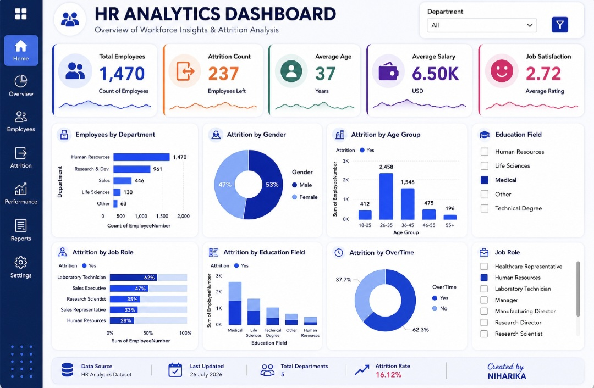

# 📊 HR Analytics Dashboard


<h1 align="center">📊 HR Analytics Dashboard</h1>

<p align="center">
Interactive Power BI Dashboard for Workforce & Employee Attrition Analysis
</p>
---

## 📌 Project Overview

The **HR Analytics Dashboard** is an interactive Power BI project designed to analyze workforce performance, employee attrition, salary trends, and job satisfaction.

It helps HR teams and business leaders identify workforce patterns, understand employee behavior, and make informed business decisions using data visualization.

---

## 🎯 Objectives

- Analyze employee attrition trends
- Monitor workforce demographics
- Track employee satisfaction
- Compare departments and job roles
- Support HR decision-making through analytics

---

## 📊 Dashboard KPIs

- 👥 Total Employees
- 🚪 Attrition Count
- 🎂 Average Age
- 💰 Average Salary
- 😊 Job Satisfaction Score

---

## 📈 Dashboard Features

### Employee Analysis
- Total Employees
- Average Age
- Average Salary
- Job Satisfaction

### Attrition Analysis
- Department-wise Attrition
- Job Role Analysis
- Gender Analysis
- Education Field Analysis
- Age Group Analysis
- Overtime Analysis

### Interactive Filters
- Department
- Education Field
- Job Role

---

## 🛠️ Tech Stack

- Microsoft Power BI
- DAX
- Power Query
- Microsoft Excel

---

## 📂 Dataset

**IBM HR Analytics Employee Attrition & Performance Dataset**

The dataset contains information about employee demographics, salary, education, job roles, attrition, satisfaction, and overtime.

---

## 📸 Dashboard Preview

<p align="center">
  
</p>

---

## 📊 Key Insights

- Department-wise employee distribution
- Employee attrition trends
- Gender-based workforce analysis
- Age group analysis
- Education field analysis
- Overtime impact on attrition
- Job satisfaction analysis

---

## 💼 Business Impact

This dashboard helps organizations:

- Improve employee retention
- Identify high-risk attrition areas
- Monitor workforce performance
- Support HR planning
- Make data-driven business decisions

---

## 📁 Repository Structure

```text
HR-Analytics-Dashboard
│
├── README.md
├── dashboard.jpg
├── HR_Analytics.pbix
└── HR_Analytics_Dataset.xlsx
```

---

## 🚀 Getting Started

1. Clone the repository.
2. Open **HR_Analytics.pbix** in Microsoft Power BI Desktop.
3. Load or refresh the dataset.
4. Explore the dashboard using the available filters.

---

## 🧠 Skills Demonstrated

- Data Cleaning
- Data Transformation
- Data Modeling
- DAX Calculations
- Dashboard Design
- Business Intelligence
- HR Analytics
- Data Visualization

---

## 👩‍💻 Created By

### **Niharika**

**Aspiring Data Analyst**

📧 Email: *your-email@example.com*

🔗 LinkedIn: *Add your LinkedIn profile link*

🐙 GitHub: https://github.com/niharikaSinghh

---

<p align="center">
⭐ If you found this project helpful, consider giving it a Star!
</p>
